# Entendiendo C
*Entender C es entender la memoria* 

Este apunte es para cuando C ya te dió muchos golpes y no le agarrás, todavía, la vuelta. Por lo tanto no vamos a ver como hacer un while, importar una función o llamarla. Eso ya lo sabés. Este apunte te sirve si cuando aparece un puntero empezás a hacer agua, y a medida que lo combinás con estructuras más complejas el tema empeora. 

Si estás en esa situación, tenés que recordar que C es un lenguaje que todo el tiempo tenés que tener en la cabeza como está y cómo funciona la memoria. Al comprender eso C ya no te va a parecer el cuco que es ahora. 

Cada ejemplo de este apunte tiene su propio main y funciones que podrían conflictuar, Por eso los ejemplos estan en archivos xxx.c.borrame, de manera que al borrar la extensión ".borrame" queda disponible para su ejecución.

el proyecto está hecho con eclipse.cpp usando gnu cross compiler. Si tenés otro IDE, otra arquitectura,
no te preocupes. Simplemente copiá los ejemplos de los .c a tu propio proyecto y ejecutalos a medida
que lo necesites. 


## Espacios de memoria

Las variables y parámetros son cahitos de memoria.
Están alojadas en un espacio que dependerá de como y dónde se defina.

Hay varios espacios de memoria:
- estática: donde se definen las variables globales y estáticas. Se reserva automáticamente al iniciar la  ejecución  del programa para cada variable definida
- pila: Se va reservando mientras se hacen las distintas llamadas a las funciones que ejecuta el programa. Los parámetros y las variables locales a la función (auxiliares) viven aquí. cuanto termina la ejecución de la función esa memoria se libera
- heap (dinámica): Es memoria que el programador pide y libera explícitamente según vaya necesitando. Útil para estructuras de datos (pilas, listas, colas, vectores dinámicos también)
- código: Las instrucciones del programa compilado se carga en memoria cuando se ejecuta. Algunos literales también puede vivir en este espacio de memoria si es que el compilador así lo decidió. Generalmente el programador no necesita saber sobre este espacio de memoria cuando programa.

En los ejemplos iniciales dejarempos por fuera la memoria heap, la introduciremos más adelante.

Ver en [example_01.c](example_01.c.borrame) los comentarios que explican en que porción de memoria se encuentra cada cosa: 

## Entendiendo las variables/parámetros

En C, una variable siempre es un espacio de memoria con las siguientes características
- Una dirección de memoria dondé comienza
- Un tamaño en bytes que es definido por el tipo de la variable.

La cantidad de bytes que ocupa cada tipo de dato podría depender de la arquitectura en la que se corre
el programa, por ejemplo en algunas arquitecturas un int ocupa 4 bytes, mientras que en otras podría ocupar 2 bytes. 
Por eso se suele usar el operador sizeof que ayuda a determinar cuanto espacio ocupa una variable.

En el caso de las variables que son punteros, siempre tienen un tamaño de bytes fijo (4 u 8 bytes, según
la arquitectura) pero saben el tipo de dato a las cosas que apuntan, y por consiguiente, el tamaño del
valor apuntado.

Con el operador `&` se puede obtener la dirección de memoria de una variable. 
Las direcciones de memoria se pueden imprimir con printf usando %p. 

El ejemplo [example_02.c](example_02.c.borrame) es una variante del ejemplo 1 en el cual muestra 
las variables y sus direcciones en un momento dado.

Esta es una ejecución en una compitadora de 64bits con linux:

```
(pila->potencia) base dir: 0x7fffffffd70c valor 2 tamaño: 4
(pila->potencia) exponente dir: 0x7fffffffd708 valor 0 tamaño: 4
(pila->potencia) i dir: 0x7fffffffd710 valor 0 tamaño: 4
(pila->potencia) aux dir: 0x7fffffffd714 valor 1 tamaño: 4
2 ^ 0 = 1
(pila->main) i dir: 0x7fffffffd744 valor: 1 tamaño: 4
(global)base dir: 0x555555558010 valor: 2 tamaño: 4
(global)cantidad dir: 0x555555558014 valor: 1 tamaño: 4
```

Notar que: 
* Las direcciones se escriben en hexadecimal porque es más cómodo (cada dos digitos hexadecimales hay un byte).
* Se ven 6 bytes, pero en realidad en mi arquitectura una dirección tiene 8 bytes, en este caso los primeros dos bytes están en 0 y por eso no se ven.
* El compilador suele acomodar las variables cercanas en memoria, por eso base y cantidad (que son globales)
Estan pegadas una a la otra: hay 4 bytes de diferencia entre esas direcciones, que es el tamaño que ocupa un int en esta arquitectura.
No se puede asumir que dos variables independinetes están contiguas.
* Notar que las direcciones globales estan muy alejadas a las direcciones de pila, porque son sectores distintos. 
* se ve como base global y base en la llamada de potencia (pila) tienen el mismo valor, pero son variables
distintas, ya que sus direcciones son distintas. Lo mismo pasa con las i de main y potencia.
* El espacio de pila para la llamada main y para la llamada de potencia son espacios distintos, desde uno no se puede ver el otro, pero sin embargo ambos estan pegaditos porque justo desde main se llamó a
potencia. .

Al correr el ejemplo pero con la cantidad en 2, pasa que hay dos llamadas a potencia. Vamos a ver que las direciones entre ambas llamadas son las mismas, pero eso se da porque en la primera llamada se reserva la memoria, al terminar se libera, y automáticamente se llama a la segunda, volivendo asignar en las proximas direcciones libres de la pila, que son casulamente las recién liberadas.

```
(pila->potencia) base dir: 0x7fffffffd6ac valor 2 tamaño: 4
(pila->potencia) exponente dir: 0x7fffffffd6a8 valor 0 tamaño: 4
(pila->potencia) i dir: 0x7fffffffd6b0 valor 0 tamaño: 4
(pila->potencia) aux dir: 0x7fffffffd6b4 valor 1 tamaño: 4
2 ^ 0 = 1
(pila->potencia) base dir: 0x7fffffffd6ac valor 2 tamaño: 4
(pila->potencia) exponente dir: 0x7fffffffd6a8 valor 1 tamaño: 4
(pila->potencia) i dir: 0x7fffffffd6b0 valor 1 tamaño: 4
(pila->potencia) aux dir: 0x7fffffffd6b4 valor 2 tamaño: 4
2 ^ 1 = 2
(pila->main) i dir: 0x7fffffffd6e4 valor: 2 tamaño: 4
(global)base dir: 0x555555558010 valor: 2 tamaño: 4
(global)cantidad dir: 0x555555558014 valor: 2 tamaño: 4
```

Pero en el [example_03.c](example_03.c.borrame), vamos a apilar varias llamadas de la misma función, para entender como se va asignando la memoria en la pila: se reserva al ingresar a la función, se devuelve al finalizar la ejecución del método: 

```
(pila->factorial(3)) numero dir: 0x7fffffffd72c valor 3 tamaño: 4
(pila->factorial(2)) numero dir: 0x7fffffffd70c valor 2 tamaño: 4
(pila->factorial(1)) numero dir: 0x7fffffffd6ec valor 1 tamaño: 4
(pila->factorial(0)) numero dir: 0x7fffffffd6cc valor 0 tamaño: 4
factorial de 3: 6
```
Acá se ve como en cada llamada se tiene que asignar un nuevo contexto de pila, porque como la llamada es recursiva, la primer llamada no termina hasta que termina la siguiente. recién en la última llamada (a factorial(0) se empieza a liberar la memoria.

Este también es el motivo por el cual una llamada recursiva que no tenga una condición de corte termina en un desbordamiento de pila (se llena toda la pila y se rompe)
 

## Modelando

Saber que las variables tienen una dirección es fundamental a la hora de entender como funcionan C, pero como los valores se asignan en la ejecución, necesitamos una manera de pensar los programas siendo  independientes de las direcciones concretas. 

Yo recomiendo graficar un instante de la memoria con un gráfico en que se ve:
- los espacios de memoria (estático, pila y heap)
- el nombre de cada variable al lado de una cajita que contendrá el valor.
- Círculos que engloban las variables que están en la pila para cada llamada a función

  Para estos programas simples quizás no aporte mucho, pero cuando veamos el tema de punteros y memoria dinámica se vuelve importante:

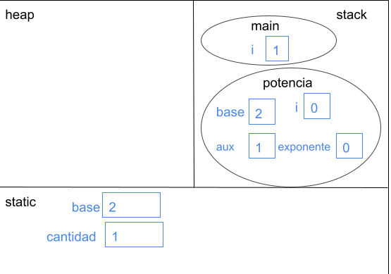
 
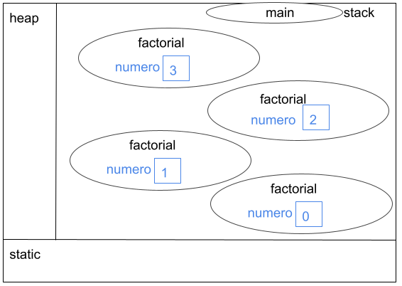


## Punteros y pasaje de parámetros por referencia

En general, los lenguajes de programación permiten dos tipos de pasaje: por valor
y por referencia. Al programador le interesa saber esta diferencia porque pasar
por valor significa que si la función llamada modifica el valor del parámetro ese cambio solo es visible en el contexto de la llamada. 
Aquel contexto que hizo la llamada original mantiene el valor previo inalterable. 

Por lo contrario, por referencia, si la función llamada modifica el valor entonces sí se ve el cambio por fuera.

Por ejemplo:

```
	void main() {
		int x = 1;
		b(x);
		printf("%d", x)
	}

	void b(int parameter) {
        	parameter++;
    	}
    
```

Si el parametro es pasado por valor, el programa imprimiría 1 (no se ven los cambios que hizo b)
mientras que si el pasaje fuera por referencia imprimiría 2 (se ve desde el main el cambio que sufrió
x en el contexto de la llamada a b)


Si pensamos en la memoria, pasar por valor significa que al invocar una función se define un nuevo espacio de memoria en el stack y se copia el valor allí. 
Entonces cualquier cambio ocurre en esa porción que sólo vive mientras la función es llamada. Al terminar la ejecución ese espacio se libera. 
Ésto es lo que vimos que pasa con el parámetro "base" en el ejemplo 1. Si bien en dicho ejemplo no modificamos el valor, al 
revisar las direcciones de memoria vemos que son espacios separados. Modificar uno no afecta a la otra.

Mientras que una llamada por referencia, la función trabaja en el mismo espacio de memoria que fue pasado como argumento, no hay copia, si se modifica el valor del parámetro, también se modifica en el contexto
externo. 

En C, todos los pasajes por parámetro son por valor. (C++ sí permite pasar por referncia, pero no C).
Hay muchas situaciones dónde se necesita un mecanismo similar al pasaje por referencia: quiero que una función modifique un espacio de memoria que le paso por parámetro. Aquí es donde nacen los punteros.

Un puntero es una variable que almacena una dirección de memoria. Anteriormente imprimimos 
la dirección de una variable utilizando el operador '&'. Si nosotros quisieramos almacenar ese
valor en una variable necesitamos que esa variable sea un puntero. En C un puntero sabe también 
a que tipo de dato corresponde el dato almacenado en la dirección a la que apunta. Por eso, si quiero
guardarme en una variable la dirección de memoria de otra variable de tipo `int`, tengo que declararla 
como un `puntero a int`. El operador `*` se usa para dos cosas. Primero, para definir que una variable es en realidad un puntero: `int * p;` es la sentencia que declara el puntero a i.
Luego, puedo asignarle un valor: `p = &miVariable`. Y finalmente, si yo quiero a través del puntero saber
el contenido de lo que apunto, uso el asterisco nuevamente `*p` .

La regla general es: `si p == &var, entonces *p == var` Se lee:  **si p es la dirección de var
entonces el contenido de p es var`**

Veamos el [example_05.c](example_05.c.borrame)

La salida es: 
```
la dirección de var es 0x7fffffffd6dc y su valor es 5
el valor de p es 0x7fffffffd6dc y su contenido es 5
la dirección de p es 0x7fffffffd6e0 (no suele interesar)
```
Notar como llego al mismo valor tanto por la variable como por el puntero. Y que
en definitiva el puntero es una variable más, que tiene un valor que puede ser modificado.

El valor concreto no suele importar, lo que importa es que es la dirección donde se aloja alguna
variable. Por eso en el diagrama de modelado, no vamos a poner un valor, vamos a 
dibujar una flecha.

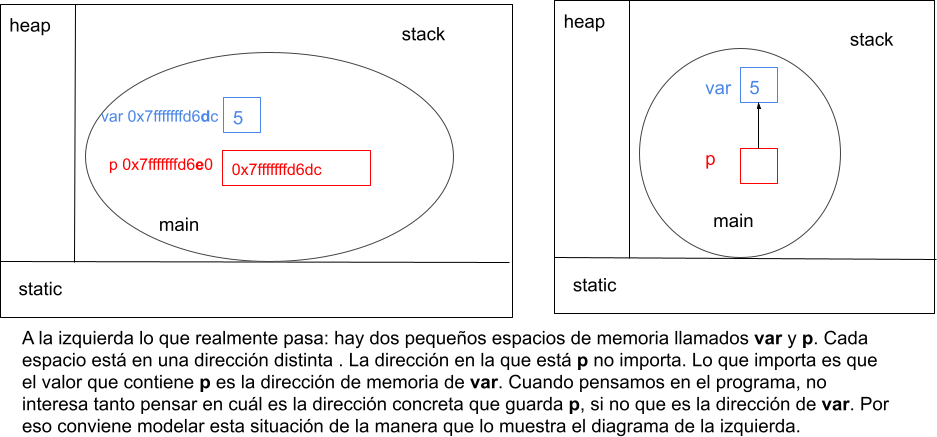

Como C no permite pasaje por referencia, no podemos hacer una función que reciba un 
entero y lo cambie, pero sí una función que reciba por valor la dirección de memoria
donde está el entero que queríamos modificar. Teniendo eso, podemos usar el * para acceder
al espacio de memoria y modificarlo. En la siguiente imagen se ve el estado al comenzar la ejecución
de la llamada al incrementar. El parámetro contador es en realidad un puntero que apunta a un sector
del stack que está por fuera del contexto de dicha función, por eso puede alterar la memoria
y el programa imprime 6.

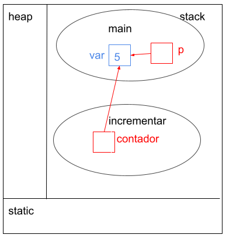

## Punteros y vectores.

Un vector/array, es un conjunto de elementos del mismo tipo, que están contiguos 
en memoria. Por lo tanto, si obtenemos un puntero al primer elemento, podemos 
acceder a cualquier elemento del mismo, ya que no olvidemos que el puntero sabe
el tamaño que tiene cada elemento al que apunta. 

Por eso, trabajar con vectores y con punteros son en definitiva lo mismo, y el
lenguaje C ofrece dos notaciones distintas para hacer exactamente lo mismo.

Las operaciones que normalmente se hacen con el índice para iterar, por ejemplo
 `i = i + 1` se pueden reemplazar usando aritmética de punteros: 
 Cuando a un puntero se le suma una unidad, suma en realidad a su contenido la cantidad
 de bytes asociada al tipo de lo que apunta. Es decir, si en un puntero a int,
 que está apuntando a la dirección 0x05, se le suma 1, el resultado es 0x09, ya 
 que el int tiene -en mi arquitectura- 4 bytes de tamanño. Pero si tengo un puntero
 a short apuntando a la misma dirección y le sumo 1, el resultado será 0x07, pues un short 
 tiene 2 bytes.
 
En el siguiente [example_06.c](example_06.c.borrame) se ven las equivalencias entre punteros y la notación vectorial. 
La salida es:

```
=====Inicializando vector =====
el tamaño en bytes del parámetro es 8
Si imprimo a lo que apunta el vector da 0x7fffffffd720
Que es lo mismo que la dirección del primer elemento: 0x7fffffffd720
la dirección del elemento actual es: 0x7fffffffd720  inicializado con: 0
la dirección del elemento actual es: 0x7fffffffd724  inicializado con: 0
la dirección del elemento actual es: 0x7fffffffd728  inicializado con: 0
la dirección del elemento actual es: 0x7fffffffd72c  inicializado con: 0
la dirección del elemento actual es: 0x7fffffffd730  inicializado con: 0
la dirección del elemento actual es: 0x7fffffffd734  inicializado con: 0
la dirección del elemento actual es: 0x7fffffffd738  inicializado con: 0
la dirección del elemento actual es: 0x7fffffffd73c  inicializado con: 0
la dirección del elemento actual es: 0x7fffffffd740  inicializado con: 0
la dirección del elemento actual es: 0x7fffffffd744  inicializado con: 0
=====Inicializando vector con punteros =====
el tamaño en bytes del parámetro es 8
Si imprimo a lo que apunta el vector da 0x7fffffffd720
la dirección del elemento actual es: 0x7fffffffd720 inicializado con: 2
la dirección del elemento actual es: 0x7fffffffd724 inicializado con: 2
la dirección del elemento actual es: 0x7fffffffd728 inicializado con: 2
la dirección del elemento actual es: 0x7fffffffd72c inicializado con: 2
la dirección del elemento actual es: 0x7fffffffd730 inicializado con: 2
la dirección del elemento actual es: 0x7fffffffd734 inicializado con: 2
la dirección del elemento actual es: 0x7fffffffd738 inicializado con: 2
la dirección del elemento actual es: 0x7fffffffd73c inicializado con: 2
la dirección del elemento actual es: 0x7fffffffd740 inicializado con: 2
la dirección del elemento actual es: 0x7fffffffd744 inicializado con: 2
```

Notar que las funciones son equivalentes, y que las direcciones de los elementos
son contiguas: van de 4 en cuatro porque se trata de un vector de enteros

Otro tema interesante, es que la manera de pasar por parámetro un vector siempre
es pasando un puntero al primer elemento, no hay manera simple de pasar una copia de todos
los elementos que vivan en el stack.

Se puede modelar el vector como una tabla, agregar el índice si hace falta.
Notar en el dibujo que los valores reales están en la pila en el contexto de main, 
mientras que el vector que está en el contexto de la función inicializadora es
un simple puntero  hacia ese espacio de memoria

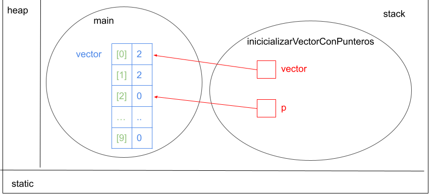

## Punteros y strings.

Los strings son vectores de chars. Por lo tanto todo lo que hablamos para vectores
vale para strings. La única diferencia es que podría haber  espacios de memoria al final del 
string que no se usan, ya que el último caracter válido viene antes de `\0`

[example_07.c](example_07.c.borrame)

## Punteros y structs.

El ejemplo [example_08.c](example_08.c.borrame) presenta un struct algo complejo.
De cada persona se quiere guardar el nombre, el genero, la fecha de nacimiento
y quien es su madre, que es otra persona. Esto genera una estructura anidada 
que puede traer un poco de dolores de cabeza.


La fecha de nacimiento también la modelamos como un struct que lo insertamos dentro
de persona.
En el caso de la madre, no hay manera de insertar todos los datos
de la madre en la misma estructura, porque ésta tiene que conocer a su abuela, y 
finalmente esa recursión no sería posible. 

Entonces la estrategia es generar una estructura anidada con punteros, en la cual
cada persona conoce a través de un puntero a su madre, y hay una persona de la cual
se desconoce su madre. Quien no conoce a su madre tendrá NULL como valor en su puntero a madre.

Tener en cuenta que los campos de un structs están contiguos en memoria. Quedaría así:

```

| nombre (15 bytes) | nacimiento (4 bytes -struct fecha-) | genero (1 byte) | madre (8 bytes - puntero- )| 
|                   | dia (1 b)|  mes (1 b) | anio (2 b)  |                 |                            |

```

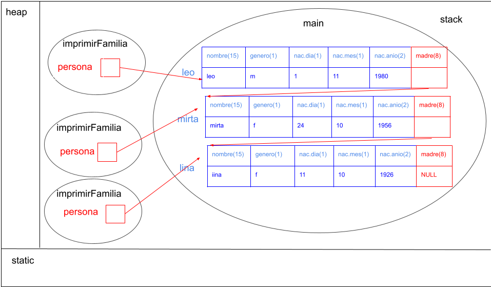

Algunas consideraciones del ejemplo:
- Muestra como usar la notación flecha `(p*)->campo` es igual a `p->campo`
- recorre una estructura anidada con una función recursiva a través de punteros
- Importante el chequeo de que la madre no sea NULL, porque si no accederías a una zona de memoria que no te pertenece, y se rompería

## Punteros, vectors y structs.

Hay principalmente dos modelos para combinar vectores y structs:

1. Que el vector tenga en su interior el contenido completo de los structs, cada uno 
a continuación.
2. Que el vector tenga punteros a structs que están en otras zonas de la memoria

El primero es quizás más simple, pero el segundo se volverá importante cuando trabajemos con
memoria dinámica.

En el [example_09.c](example_09.c.borrame) se ven estas dos variantes. Además hay otra estrategia para
inicializar los structus: en lugar de pasar un puntero para que la función inicializadora
modifique la memoria en el main, la función genera su propio struct en su espacio de memoria,
inicializa los variables y lo devuelve. El devolver es una acción similar al pasaje por valor
de los parametros: se realiza una copia de la memoria de aquello que se está devolviendo
en donde sea que se esté invocando. la llamada:
`leo = crearPersona("Leo",'m', 1,11,1980)` pone primero los datos en una estructura en
el contexto de crear Persona, al devolverse se copia todos esos valores en la memoria
que corresponde a la variable `leo` quedando dichos valores en el espacio de memoria
de la llamada a main.


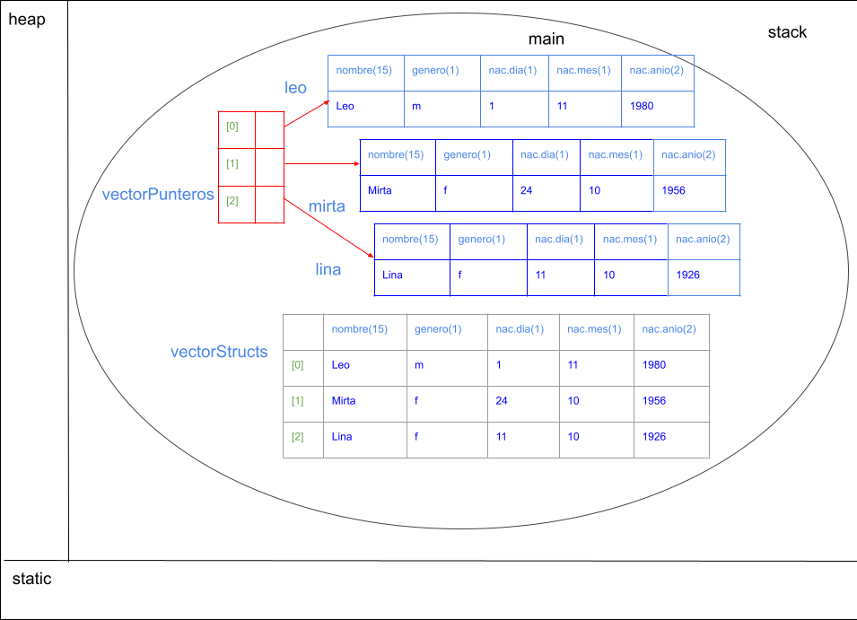
 

## Memoria dinámica (heap)

Finalmente llegamos a la memoria dinámica! el famoso heap.
El manejo de punteros en la memoria dinámica es igual a todo lo que estuvimos trabajando 
en los puntos anteriores. La diferencia es que la memoria dinámica se asigna
a pedido del programador, y se debe devolver cuando éste ya no lo necesite.
Es distinta a la memoria de pila, ya que esta se autogestiona: se asigna al llamar
una función, se devuelve a terminar la llamada.
Y es también distinta a la memoria estática, ya que esta una vez asignada no se devuelve.

Veamos el ejemplo de las personas que conocen a su madre, pero en lugar de mantenerlas en
la pila de main, la vamos a mantener en el heap. En el main solo necesitamos conocer a la persona
que inicia la cadena:

Las siguientes imágenes muestran el estado de la memoria luego de cada llamada de crear persona.
Notar que en la memoria heap no hay nombres de variables asociados a las direcciones. Siempre
accedemos a esos espacios a través de punteros

[example_09.c](example_09.c.borrame)

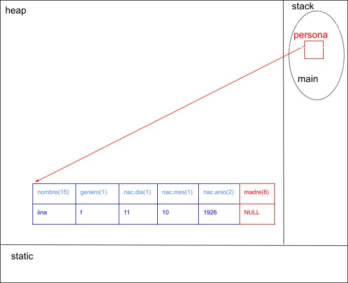
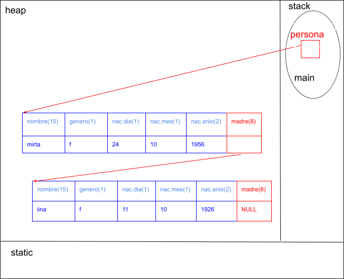
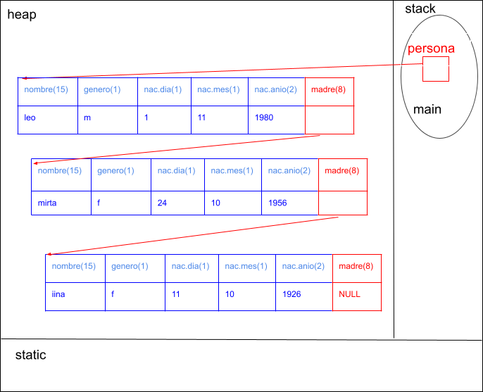


## Vectores dinámicos con structs 

En lugar de malloc se puede utilizar realloc cuando se necesita asginar 
memoria y luego redimensaionar ese espacio de memoria.
Esto es especialmente util para utilizar con vectores, ya que el gran problema
de los vectores es que se requiere un tamaño fijo para trabajar.
Al combinarlo con realloc, podemos tener un tamaño variable. 

Realloc busca un espacio disponible con el tamaño suficiente para el nuevo
requerimiento de memoria  y copia los valores originales al nuevo espacio.

Teniendo en cuenta eso, es conveniente para trabajar con vectores dinámicos el
modelo en que se guardan punteros a sctructs y no todo el struct, ya que eso mantiene
el vector más chico haciendo más simple las operaciones de realloc.

El siguiente ejemplo muestra como agrandamos el vector cuando se llena.
Maneja el concpeto de lote para no hacer el realloc en cada elemento

[example_11.c](example_11.c.borrame)

```
reservando nuevos 3 elementos. Nueva direccion 0x5555555592a0
Agregando a Lina
Agregando a Mirta
Agregando a Leo
reservando nuevos 3 elementos. Nueva direccion 0x555555559730
Agregando a Yesica
Agregando a Elisa
Agregando a Pablo
reservando nuevos 3 elementos. Nueva direccion 0x5555555597b0
Agregando a Daniel
Nombre: Lina, Genero: f, Nacimiento: (11/10/926)
Nombre: Mirta, Genero: f, Nacimiento: (24/10/1956)
Nombre: Leo, Genero: m, Nacimiento: (1/11/1980)
Nombre: Yesica, Genero: f, Nacimiento: (1/12/1984)
Nombre: Elisa, Genero: f, Nacimiento: (13/12/1984)
Nombre: Pablo, Genero: m, Nacimiento: (11/8/1978)
Nombre: Daniel, Genero: m, Nacimiento: (16/2/1950)
```

En un instante dado la memoria se ve así:
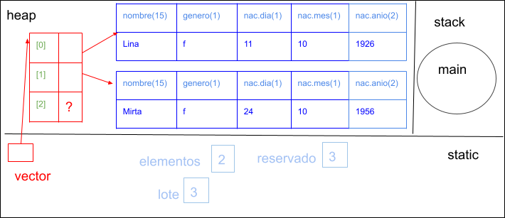


 
 
 
 
 ,
 


